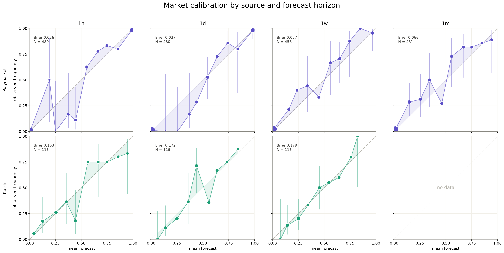

# Prediction Market Calibration

<p align="center">
    
</p>

<p align="center">
    
    <br />
    <br />
    
</p>

Research Tooling for evaluation of prediction markets, including probabalistic calibration and market consistency. Prediction markets are unique platforms where traders buy and sell contracts based on the outcomes of future events. The prices of these contracts can be interpreted as the collective probability estimates of the market participants regarding those events.

> **N.B** This project is primarily research focussed. using Polymarket and Kalshi's open API, it does not place trades. This project is not to encite or encourage market speculation nor trading on Polymarket or any other prediction market platform. It is intended for research purposes only.
    


By analyzing the data from resolved markets on these platforms, we can assess how well the market prices align with actual outcomes, providing insights into the accuracy and reliability of prediction markets as forecasting tools.

## Project Structure

```
prediction-market-calibration/
├── data/
│   ├── raw/
│   │   └── market_data.csv          # raw pulled markets before cleaning
│   └── processed/
│       ├── kalshi_table.csv         # cleaned Kalshi rows
│       ├── polymarket_table.csv     # cleaned Polymarket rows
│       └── modelling_table.csv      # combined long-format table used for scoring
├── notebooks/
│   └── EDA.ipynb                    # exploratory analysis
├── public/                          # logos and images for the README
│   ├── k_logo.png
│   ├── pm_logo.png
│   └── research.png
├── results/                         # plots and tables generated by scripts
├── src/
│   ├── collect/                     # API clients
│   │   ├── clob.py                  # Polymarket CLOB 
│   │   ├── gamma.py                 # Polymarket Gamma
│   │   └── kalshi.py                # Kalshi 
│   ├── data_models/                 # wrappers for API objects
│   │   ├── gammaMarket.py
│   │   └── kalshiMarket.py
│   ├── scripts/
│   │   ├── calibration.py           # reliability curves + calibration plot
│   │   ├── cleaning.py              # dedupe, filter, unify schema
│   │   ├── consistency.py           # internal-coherence checks
│   │   └── fetch_data.py            # orchestrates collection into a table
│   ├── config.py                    # paths and constants
│   └── main.py                      # entry point: fetch -> clean -> analyse
├── .gitignore
├── README.md
└── requirements.txt